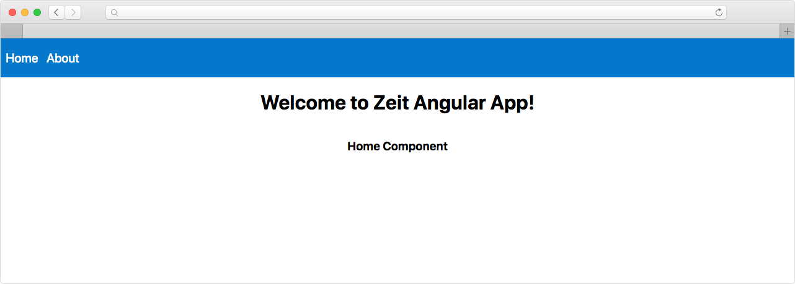

# Angular 7

In this example we will be deploying a simple example with Angular v7 with simple routing




## Getting started with Angular 7

Install the Angular CLI globally.

```
npm install -g @angular/cli
```

Start a new angular project

```
ng new my-app
```

### Run app in development mode

```
yarn start
```

### To create a new component

Go to `./src/app` create `components` directory. Now lets generate three components by using flag `--spec=false` we can skip genereating `.spec` testing files

```

cd ./src/app
mkdir components
ng generate component  --spec=false about
ng generate component  --spec=false home
ng generate component  --spec=false header

```

It will generate three files `Markup,Component,StyleSheet`

### Register Router and Routes

Go to `./src/app/app-routing.module.ts` include all our app routes

```js

import { AboutComponent } from './components/about/about.component';
import { HomeComponent } from './components/home/home.component';
const routes: Routes = [
  { path: 'about', component: AboutComponent },
  { path: 'home', component: HomeComponent },
];

```

Then add `<router-outlet></router-outlet>` to out root of AppComponent:

The router outlet serves as a placeholder when the routed components will be rendered.

# Deploy with Now

First we need to create a now.json configuration file to instruct Now how to build the project.

For this example we will be using our newest version Now 2.0.

By adding the version key to the now.json file, we can specify which Now Platform version to use.

```json
{
  "version": 2,
  "name": "zeit-angular-app",
  "builds": [
    {
      "src": "package.json",
      "use": "@now/static-build"
    }
  ],
  "routes": [
    {
      "src": "/(assets/.+|.+\\.css|.+\\.js)",
      "headers": {
        "cache-control": "max-age=31536000,immutable"
      },
      "dest": "/$1"
    },
    {
      "src": "/(.*).html",
      "headers": {
        "cache-control": "public,max-age=0,must-revalidate"
      },
      "dest": "/$1.html"
    },
    {
      "src": "/(.*)",
      "headers": {
        "cache-control": "public,max-age=0,must-revalidate"
      },
      "dest": "/index.html"
    }
  ]
}
```

Create `.nowignore` and add `node_modules`

We are now ready to deploy the app.

```
now
```

App looks like this when you deploy https://zeit-angular-app-gksnyrvbi.now.sh

Visit our [guide for more info ](https://zeit.co/guides/deploying-angular-with-now) how to deploy angular app with now.