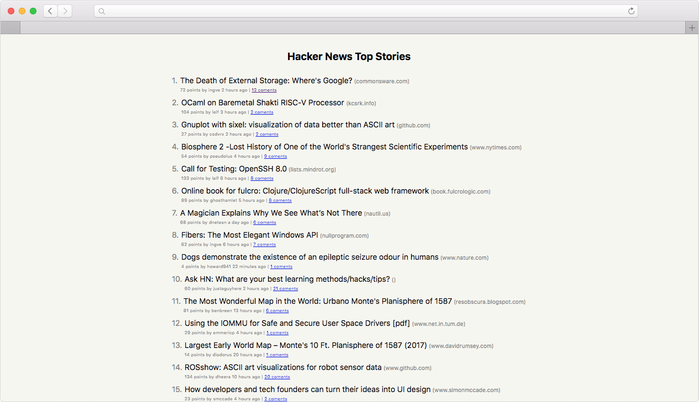

# HackerNews Angular App

In this example we will be deploying a simple Hacker News Angular application.




# Getting started

Install the Angular CLI globally.

```bash
npm install -g @angular/cli
```

## How to start


```bash
npm install
```

## Run app in development mode

```bash
npm run start
```

Open your browser on http://localhost:4200/


# Deploy with Now


First we need to create a now.json configuration file to instruct Now how to build the project.

For this example we will be using our newest version Now 2.0.

By adding the version key to the now.json file, we can specify which Now Platform version to use.

```json
{
  "version": 2,
  "name": "zeit-angular-app",
  "builds": [
    {
      "src": "package.json",
      "use": "@now/static-build"
    }
  ],
  "routes": [
    {
      "src": "/(assets/.+|.+\\.css|.+\\.js)",
      "headers": {
        "cache-control": "max-age=31536000,immutable"
      },
      "dest": "/$1"
    },
    {
      "src": "/(.*).html",
      "headers": {
        "cache-control": "public,max-age=0,must-revalidate"
      },
      "dest": "/$1.html"
    },
    {
      "src": "/(.*)",
      "headers": {
        "cache-control": "public,max-age=0,must-revalidate"
      },
      "dest": "/index.html"
    }
  ]
}
```

Create `.nowignore` and add `node_modules`

For the build property that you configured, add a now-build script in `package.json ` file to specify what command Now will run to build the app in the cloud.

```
"scripts": {
    "now-build": "ng build --prod --output-path dist"
  }
```

We are now ready to deploy the app.

```
now
```

App looks like this when you deploy https://zeit-angular-app-exr7ho5vt.now.sh

Visit our [guide for more info ](https://zeit.co/guides/deploying-angular-with-now) how to deploy angular app with now.