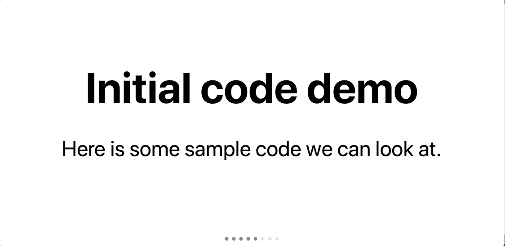

# Advanced MDX-deck

In this example we will be deploying an [mdx-deck](https://github.com/jxnblk/mdx-deck) presentation which will also contain:
+ Images that we want to be available offline
+ Custom MDX-deck layouts
+ Code snippets that we want to be available offline
+ A custom [Codesurfer](https://elijahmanor.com/code-surfer/) React component to navigate code snippets


## Getting started with Advanced MDX-deck
A sample presentation has been created at `demo-advanced.mdx`

### Deploy with Now

First we need to create a `now.json` configuration file to instruct Now how to build the project.

For this example we will be using our newest version [Now 2.0](https://zeit.co/now).

By adding the `version` key to the `now.json` file, we can specify which Now Platform version to use.

We also need to define each builders we would like to use. [Builders](https://zeit.co/docs/v2/deployments/builders/overview/) are modules that take a deployment's source and return an output, consisting of [either static files or dynamic Lambdas](https://zeit.co/docs/v2/deployments/builds/#sources-and-outputs).

Then we need to add a `now.json` file to specify we want to use our Platform V2.

In this case we are going to use `@now/static-build` to build and deploy our static application selecting the `package.json` as our entry point. We will also define a name for our project (optional).

```json
{
  "version": 2,
  "name": "mdx-deck-advanced",
  "builds": [
    {"src": "package.json", "use": "@now/static-build"}
  ],
  "routes": [
    { "src": "^/images/(.*)", "dest": "/images/$1" },
    { "src": "^/snippets/(.*)", "dest": "/snippets/$1" },
    { "src": "index.html", "dest": "/index.html" }
  ]
}
```

Visit our [documentation](https://zeit.co/docs/v2/deployments/configuration) for more information on the `now.json` configuration file.

We also need to include a script in `package.json` named `"now-build"` that specifies what command Now will run on the server to "build" your application.

By default, MDX-deck will output the build to the `dist` directory. We also need to explictly copy folders containing our images and our snippets to the `dist` folder.

```json
{
    "scripts": {
        ...
        "now-build": "rm -rf dist/ && mdx-deck build demo-advanced.mdx --no-html && cp -r images dist/ && cp -r snippets dist/"
    }
}
```

We are now ready to deploy the app.

```
now
```
